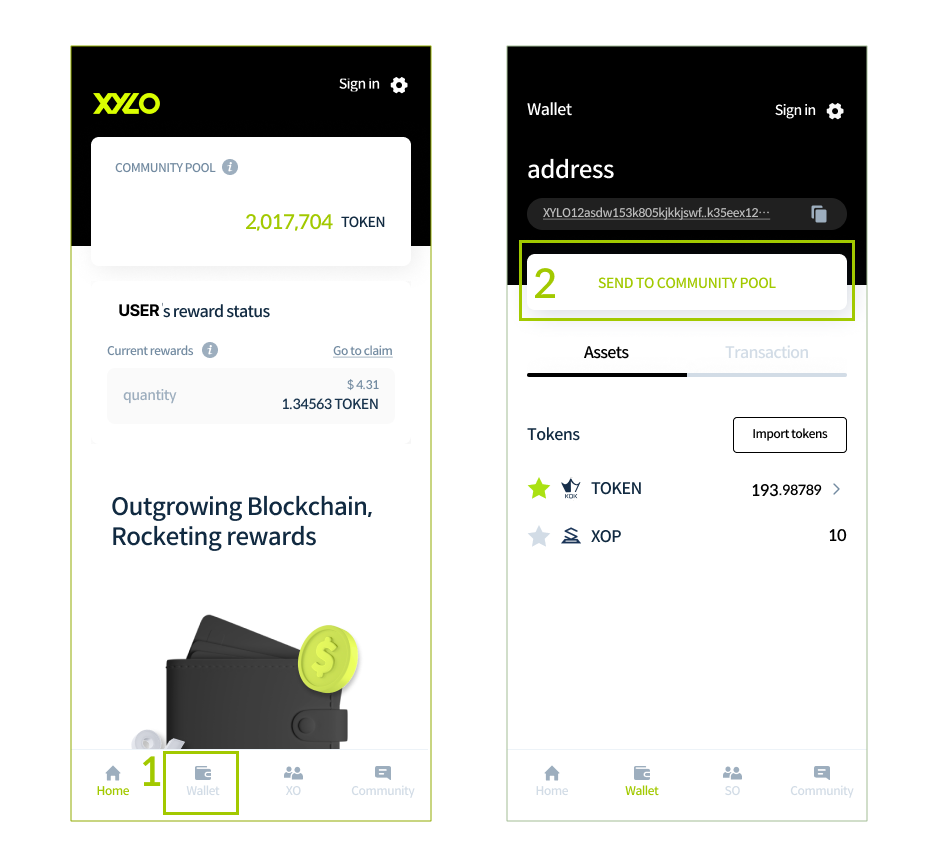
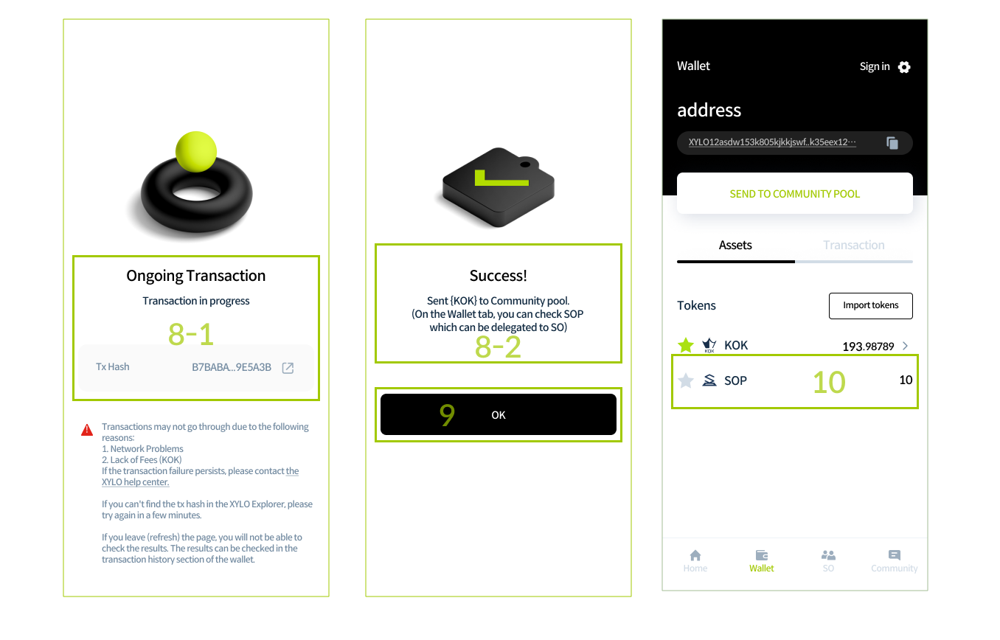
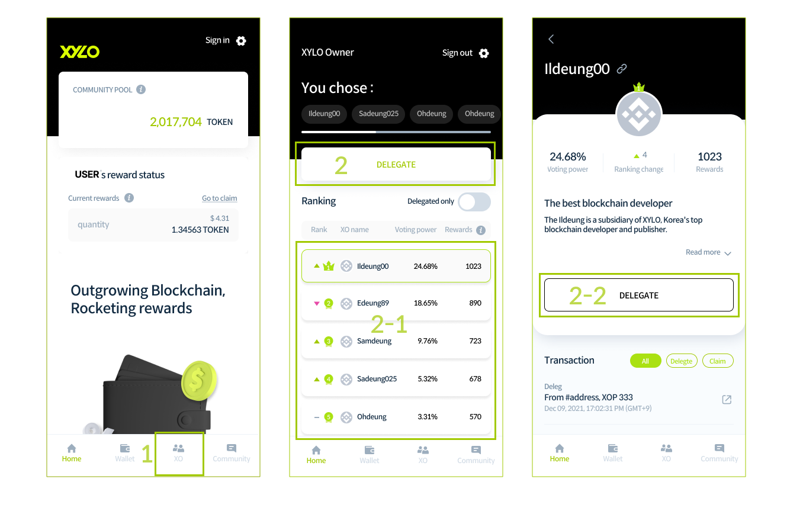
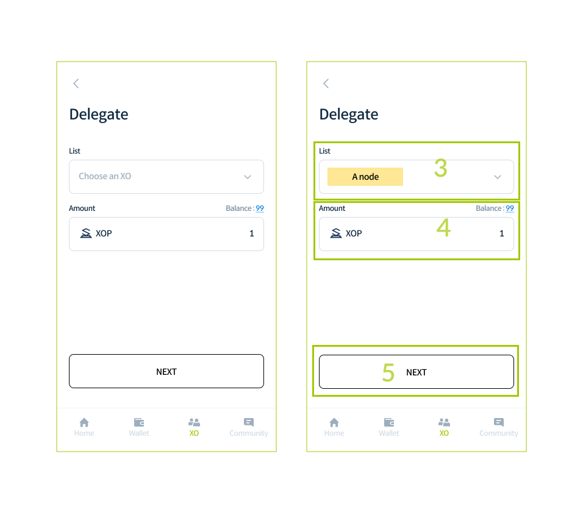
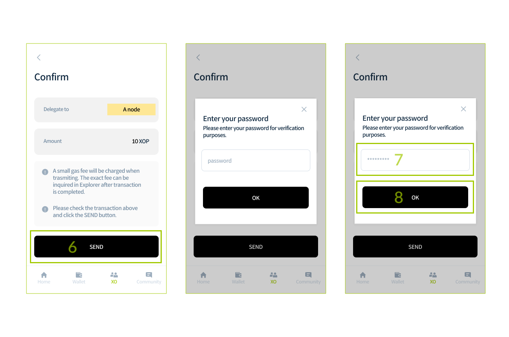
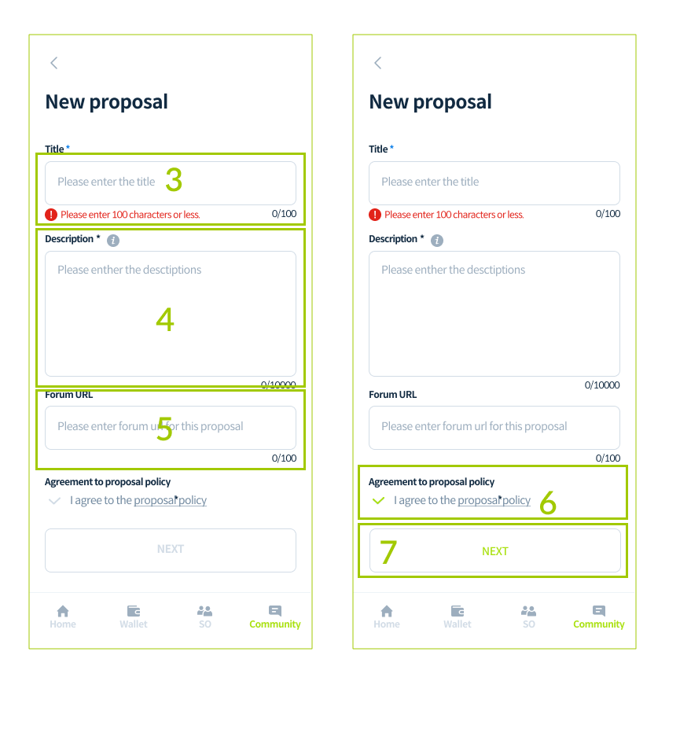
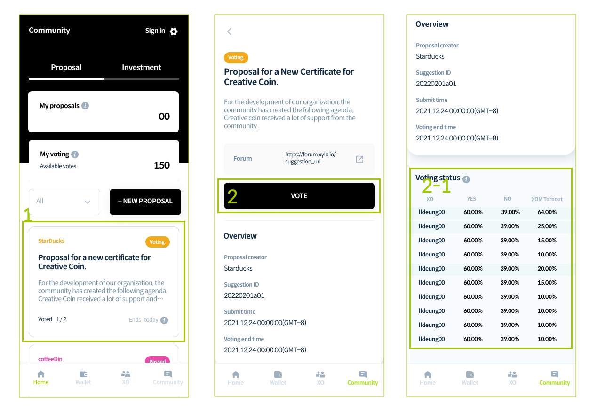

# XYLO 올인원 가이드

## XYLO&#x20;

앱 다운로드 후 회원가입 완료 시 자동으로 XYLO 지갑 주소가 생성됩니다. XYLO 지갑은 TOKEN 입금 및 Community Pool로 송금, 리워드 출금, 브릿지 서비스의 지갑 연동 등에 사용하실 수 있습니다.


XYLO APP은 그라운드 체인 네트워크를 사용하므로 이더리움 네트워크의 TOKEN를 보낼때 Bridge를 이용하여 TOKEN의 네트워크를 변환해 주십시오. 디지털 자산의 특성 상 부정확한 입금 시 복구가 불가능합니다.&#x20;

<mark style="color:red;background-color:red;">**실수 시 TOKEN를 찾을 수 없으므로 먼저 소량의 TOKEN로 변환 테스트를 권장합니다.**</mark>&#x20;

또한 TOKEN와 이더리움의 지갑 주소 형식이 동일 하더라도 동일한 블록체인 네트워크를 사용하지 않으니 네트워크 유형을 확인하시기 바랍니다.


### XYLO 앱 다운로드

1. 해당하는 모바일 기기 운영체제에 대한 다운로드 링크를 통해 기기의 앱 스토어로 이동합니다.( Android , iOS )
2. 모바일 기기에 XYLO 앱을 설치합니다.

### 회원가입

1. XYLO 앱을 실행한 후 상단의 Sign In 버튼을 클릭 합니다. Sign In 페이지에서 Sign Up 버튼을 클릭하여 회원가입 페이지로 이동합니다.&#x20;


SEND TO COMMUNITY를 실행하기 위해서는 XYLO 월렛이 필요합니다. 지갑 생성을 위해 회원가입을 먼저 진행해주세요.


<figure><figcaption></figcaption></figure>

<figure><figcaption></figcaption></figure>

2\. 아이디, 이름을 입력합니다.

3\. 비밀번호를 입력한 후 앞서 입력한 비밀번호를 다시 한 번 입력합니다.

4\. 이메일을 입력한 후 Activate 버튼을 클릭합니다.&#x20;


이메일은 본인확인 수단으로 사용되므로 실제 사용중인 주소를 입력해주세요.


<figure><figcaption></figcaption></figure>

5\. 별도의 이메일 창에서 인증코드를 확인한 후 복사합니다.

6\. 인증코드를 입력한 후 Confirm 버튼을 클릭합니다.

7\. 이용약관 및 개인정보처방침에 동의합니다.

8\. CREATE ACCOUNT 버튼을 클릭합니다.

<figure><figcaption></figcaption></figure>

### 가입 확인 및 로그인

1. 환영합니다! 가입이 완료되었습니다. Sign In 버튼을 클릭합니다.
2. 가입 시 사용한 아이디, 비밀번호를 입력합니다. (자동 로그인 선택사항) 비밀번호를 잃어버린 경우 Forgot Password를 통해 비밀번호를 재설정할 수 있습니다.
3. Sign In 버튼을 클릭하여 로그인 완료 후 메인으로 이동합니다.

<figure><figcaption></figcaption></figure>

### 새 지갑 확인

1. XYLO App 하단의 Wallet 메뉴로 이동합니다.
2. 가입과 함께 생성된 지갑 주소와 자산을 확인합니다.

<figure><figcaption></figcaption></figure>

### TOKEN 토큰 받기

1. TOKEN 거래를 지원하는 거래소에서 TOKEN를 구매합니다.
2. 거래소에서 메타 마스크 지갑 주소로 TOKEN전송합니다.
3. 브릿지를 사용하여 TOKEN의 네트워크를 이더리움 네트워크에서 그라운드체인 네트워크로 변경합니다. 자세한 사용 방법은 Use Bridge 참고해주세요.

## 브릿지&#x20;

### 메타마스크에 TOKEN 토큰 추가

1. 네트워크(이더리움 메인넷)를 확인합니다.
2. '토큰 가져오기' 클릭합니다.
3. '맞춤형 토큰'을 클릭합니다.
4. 토큰 계약 주소를 입력합니다.&#x20;

```
0x9b9647431632af44be02ddd22477ed94d14aacaa
```

5\. '맞춤형 토큰 추가' 버튼을 클릭합니다.&#x20;


토큰 계약 주소를 입력하면 토큰 기호와 토큰 십진수가 자동으로 입력됩니다.


6\. TOKEN가 표시되면 '토큰 가져오기' 버튼을 클릭합니다.

7\. TOKEN 토큰 추가가 완료되었습니다. 입금 실수 시 TOKEN를 찾을 수 없으니 먼저 소량의 TOKEN 전송 테스트를 해보는 것을 추천합니다.


입금 실수 시 TOKEN를 찾을 수 없으니 먼저 소량의 KOK 전송 테스트를 해보는 것을 추천합니다.


## 이더리움 네트워크 -> 그라운드체인 네트워크&#x20;

### Step 01

1. Asset의 선택 박스를 클릭합니다.
2. Select a coin 팝업이 뜨면 TOKEN를 선택한 후 Select 버튼을 클릭합니다.

### Step 02

1. From의 선택 박스를 클릭하여 이더리움을 선택합니다.
2. 메타마스크를 선택한 후 OK 버튼을 클릭합니다.&#x20;

메타마스크의 네트워크가 이더리움 네트워크가 아닐 경우 Network Error 경고창이 등장합니다.

3\. To의 선택박스를 클릭하여 XYLO Ground Chain을 클릭합니다.

4\. XYLO Wallet을 클릭한 후 OK 버튼을 클릭합니다.

5\. XYLO APP 가입 시 생성한 아이디, 비밀번호를 입력합니다. 계정이 없는 경우 XYLO App 회원가입이 필요합니다. 자세한 가입 방법은 Get Started 참고해 주세요.

6\. To 체인에 대한 Destination이 자동 입력됩니다.

### Step 03

1. 변환할 TOKEN 금액을 입력합니다. 수수료를 제외한 금액을 입력하세요.&#x20;

최소 전환 수량은 100TOKEN 입니다. 최소 전환 수량보다 적은 수량의 TOKEN를 변환 시도할 경우 경고창이 등장합니다.

2\. Convert now 버튼을 클릭합니다.

3\. Check the coin to convert 팝업에서 입력한 내용과 수수료 및 주의사항을 확인한 후 OK 버튼을 클릭합니다. 이더리움 네트워크에서 그라운드체인 네트워크로 변환할 경우 수수료와 Bridge fee 20 TOKEN가 필요합니다. OK 버튼 클릭 시 최초 1회 데스크탑 알림 설정을 진행합니다. 알림 설정 창이 뜨면 OK버튼을 클릭해 주세요.

### Step 04

1. From 체인에 연결된 메타마스크에서 승인 처리를 진행합니다.
2. From 체인에 연결된 메타마스크에서 가스 수수료를 확인합니다. 소량의 이더리움 수수료가 발생됩니다.
3. From 체인 승인처리가 완료되면 트랜잭션이 생성됩니다. 트랜잭션 hash 클릭 시 Explorer로 이동하며 자세한 트랜잭션 정보를 확인할 수 있습니다.
4. Bridge 페이지 내 별도로 생성된 To 체인의 Confirm 버튼을 클릭합니다.
5. Approve 버튼을 클릭하여 To 체인의 승인 처리를 진행합니다.
6. To 체인 승인 처리가 완료되면 트랜잭션을 확인할 수 있습니다. 최종 변환이 완료되었습니다.&#x20;


XYLO APP의 Wallet 페이지에서 전송된 TOKEN를 확인할 수 있습니다.


### 히스토리 확인

1. History 메뉴 또는 우상단 Transaction으로 이동하여 트랜잭션 상태를 확인할 수 있습니다.

#### 히스토리 상태



작업이 성공적으로 완료되었습니다.&#x20;



To 체인에 연결된 지갑에서 트랜잭션 승인이 필요한 상태입니다. Confirm 버튼을 클릭하여 승인 처리를 진행합니다.&#x20;



현재 트랜잭션이 진행 중인 상황으로, 전환이 완료 상태로 변경될 때까지 대기합니다.



Timeout 또는 To 체인에 연결된 지갑에서 전송에 실패한 상태로 Refund 버튼을 클릭하여 환불을 진행합니다.



### 오류시 대처 방법 브릿지 사용 중 오류 발생 시

#### 브릿지 사용 중 오류 발생 시&#x20;

상단 History에서 나의 모든 TOKEN 전환 내역을 확인 가능합니다. 전송 중 Confirm 버튼을 클릭하지 못한 경우 History에서 전환 중 누르지 못한 Confirm을 진행할 수 있습니다. 또한 Confirm을 48시간 동안 누르지 않을 경우 환불 절차가 진행되며 History에서 해당 절차를 확인하실 수 있습니다.


## 위임&#x20;

### Community Pool 송금

1. XYLO 앱 실행 로그인 완료 후 Wallet 메뉴로 이동합니다.
2. 상단의 SEND TO COMMUNITY POOL 버튼을 탭 합니다.&#x20;


Community Pool 송금 및 어플을 이용하기 위해서는 TOKEN 가 필요합니다.&#x20;

회원가입 및 브릿지에서 TOKEN 자산전송을 먼저 진행해 주세요.


<figure><figcaption></figcaption></figure>

3\. 유의사항에 동의하고, 전송할 TOKEN를 입력합니다.

4\. NEXT를 클릭 합니다.&#x20;


보유하신 TOKEN중 수수료를 제외한 수량을 입력해 주세요. 10개 이상부터 전송 가능합니다.


<figure><figcaption></figcaption></figure>

5\. 전송 TOKEN수량 확인 후 SEND 버튼을 클릭 합니다.

6\. Enter your password 팝업에서 비밀번호를 입력합니다.

7\. OK버튼을 클릭 합니다.&#x20;

<figure><figcaption></figcaption></figure>

8-1. 트랜잭션이 발생합니다.&#x20;

8-2. Success! 메세지를 확인합니다.

9\. OK버튼을 클릭 합니다.

10\. Wallet 메뉴에서 XOP 및 트랜잭션을 확인 할 수 있습니다.

<figure><figcaption></figcaption></figure>

### XO위임하는 방법

1. XYLO 앱 실행 로그인 완료 후 XO 메뉴로 이동합니다.
2. DELEGATE 버튼을 클릭 합니다.&#x20;


2-1. XO 리스트에서 각 XO를 클릭하면 상세 정보를 확인하실 수 있습니다.&#x20;

2-2. 상세페이지 내부에서도 DELEGATE를 진행할 수 있습니다.


<figure><figcaption></figcaption></figure>

3\. List에서 위임할 XO를 선택합니다.

4\. XOP수량을 입력합니다.

5\. NEXT 버튼을 클릭 합니다.

<figure><figcaption></figcaption></figure>

6\. 입력된 정보 확인 후 SEND 버튼을 클릭 합니다.

7\. Enter your password 팝업에서 비밀번호를 입력합니다.

8\. OK버튼을 클릭 합니다.&#x20;

<figure><figcaption></figcaption></figure>

9-1. 트랜잭션이 발생합니다.&#x20;

9-2. Success! 메세지를 확인합니다.

10\. OK버튼을 클릭 합니다.

<figure><figcaption></figcaption></figure>

11\. XO의 상세페이지에서 위임 현황 및 리워드를 확인할 수 있습니다.

12\. 상세페이지 하단에서 XOP전송 트랜젝션을 확인할 수 있습니다.&#x20;


네트워크 상태에 따라 위임한 XOP 반영되는 시간이 상이할 수 있습니다


<figure><figcaption></figcaption></figure>


### 리워드 출금

1. XYLO App을 실행해 로그인 완료 후 App 하단의 XO 메뉴로 이동합니다.
2. 위임한 XO의 상세 페이지로 이동합니다.
3. 리워드로 받은 TOKEN 금액을 확인하고, CLAIM 버튼을 클릭 합니다.

<figure><figcaption></figcaption></figure>

4\. TOKEN금액 확인 후 CONFIRM 버튼을 클릭 합니다.

5 비밀번호를 입력합니다.

6\. OK 버튼을 클릭 합니다.

<figure><figcaption></figcaption></figure>

7\. 트랜잭션이 발생합니다.

8\. Success! 메세지를 확인합니다.

9\. OK버튼을 클릭 합니다.

<figure><figcaption></figcaption></figure>

10\. XO의 상세 페이지에서 트랜잭션을 확인하실 수 있습니다.

11\. Wallet메뉴로 이동하여 TOKEN및 트랜잭션을 확인하실 수 있습니다.

<figure><figcaption></figcaption></figure>


## Community&#x20;

### 투표글 게시

1. Community 메뉴로 이동합니다.
2. NEW PROPOSAL 버튼을 클릭합니다.

<figure><figcaption></figcaption></figure>

3\. 투표글 제목을 입력합니다.

4\. 투표 내용을 입력합니다.

5\. (선택)포럼 예비심사 게시글의 URL을 입력합니다.

6\. 제안 정책에 동의합니다.

7\. NEXT 버튼을 클릭합니다.

<figure><figcaption></figcaption></figure>

8\. Send deposit 페이지에서 Available을 클릭하면 자동으로 10,000 TOKEN의 보증금이 입력됩니다. 보증금을 전송하기 위한 트랜잭션 수수료는 별도입니다.

9\. 보증금 입력 후 NEXT 버튼을 클릭합니다.

10\. PROPOSE 버튼을 클릭합니다.

<figure><figcaption></figcaption></figure>

11\. Enter your password 팝업에서 비밀번호를 입력합니다.

12\. OK 버튼을 클릭합니다.

<figure><figcaption></figcaption></figure>

13\. 투표 게시글 제안 등록 완료 메시지가 표시되면 OK 버튼을 클릭하여 메인으로 이동합니다.

<figure><figcaption></figcaption></figure>


### 투표 상태별 게시글 확인법&#x20;


투표 게시글의 상태는 투표 게시글 우상단에서 확인하실 수 있습니다. My Voting의 투표권 수량을 클릭 시 투표에 참여할 수 있는 제안을 필터링하여 확인하실 수 있습니다.


1. Community 메뉴로 이동합니다.
2. NEW PROPOSAL 좌측 ALL을 클릭합니다.
3. ALL, Voting, Passed, Rejected 총 4가지의 게시글 상태가 노출되며 원하는 상태를 클릭합니다.

<figure><figcaption></figcaption></figure>

### 투표 진행하기

1. 원하는 투표 게시글을 클릭하여 해당 제안의 상세 페이지로 이동합니다.
2. 선택한 투표 게시글에서 VOTE 버튼을 클릭합니다.&#x20;

&#x20;    2-1. 투표 게시글 하단에서 투표 현황을 확인할 수 있습니다.&#x20;


투표 기간 종료 시까지 XOM 투표 참여율이 보팅 파워 기준 20% 이상인 경우에만 해당 XO가 최종 의견을 제출할 수 있습니다. 20% 이상의 참여율이 달성된 경우 투표 현황에서 별도의 색상 처리를 통해 최종 의견을 제출할 수 있는 XO들을 표시합니다.


<figure><figcaption></figcaption></figure>

3\. 투표권이 없는 경우 해당 페이지로 이동합니다. XOP를 월렛에 보유 중인 경우 DELEGATE를 진행거나 Community Pool 투자를 통해 XOP를 받아 위임하실 수 있습니다.

<figure><figcaption></figcaption></figure>

4\. 투표권을 보유하고 있을 경우 100XOP 이상 위임한 XO의 XOM 투표권 목록을 확인 가능하며, YES 또는 NO 의견을 선택할 수 있습니다. 한 번 제출한 a의견은 번복할 수 없습니다.

5\. VOTE 버튼을 클릭하여 선택한 의견대로 투표를 완료합니다.

<figure><figcaption></figcaption></figure>

6\. XO 별로 다수의 투표권을 보유한 경우 발행된 투표권마다 다른 의견을 선택 후 투표할 수 있습니다.&#x20;

&#x20;  6-1. VOTE 버튼을 클릭할 경우 투표 완료 메시지가 표시되며 투표를 진행한 XO 그룹명이 표시됩니다.&#x20;

&#x20;  6-2. 또한 Voting status에서 반영된 투표 결과가 노출됩니다.&#x20;

&#x20;  6-3. 이미 완료된 투표는 수정이 불가능하며 진행하지 않은 투표는 투표가 가능합니다.

<figure><figcaption></figcaption></figure>

<figure><figcaption></figcaption></figure>

7\. 다수의 투표권을 보유한 경우 투표권마다 다른 선택으로 투표가 가능합니다.&#x20;

&#x20;  7-1. 다수의 투표권을 사용한 경우 투표 완료 메시지가 표시되며 투표를 진행한 다수 XO 그룹명이 표시됩니다.&#x20;

&#x20;  7-2. 다수의 투표권을 사용한 경우 사용한 만큼 Voting status에서 반영된 투표 결과가 노출됩니다.

<figure><figcaption></figcaption></figure>

### 투표 결과 확인&#x20;


투표 기간이 종료되면 각 XO 별로 투표 결과가 자동 집계됩니다. XO 별 최종 투표는 XOM 분들의 투표 결과에 따른 최종 의견과 XO의 보팅 파워로 제출됩니다. 최종 투표를 제출할 수 있는 XO의 정족수가 40% 이상이고 찬성률이 50% 이상인 경우 해당 제안은 통과됩니다. 투표 결과에 대하여 자세한 설명을 원하실 경우 XYLO VC 프로세스를 참고하실 수 있습니다.


#### 투표 부결 시

1. 투표가 부결될 경우 투표 상태가 Rejected로 표기됩니다.
2. 투표가 종료된 제안의 상세 페이지에서 MY VOTES 버튼을 클릭하면 내 투표 결과를 확인하실 수 있습니다.&#x20;

2-1. My Voting 페이지에서 투표 결과를 확인하실 수 있습니다.

3.Vote overview 항목에서 SO의 보팅 파워가 반영된 최종 투표 결과를 확인하실 수 있습니다.

4\. Turnout 항목에서 XO 의 정족수를 확인하실 수 있습니다.

5\. SO group results 항목에서 XO 그룹별 투표(XOM 투표) 결과를 확인하실 수 있습니다.

<figure><figcaption></figcaption></figure>

#### 투표 가결 시&#x20;

1. 투표가 가결될 경우 투표 상태가 Passed 표기됩니다.&#x20;
2. 투표가 종료된 제안의 상세 페이지에서 MY VOTES 버튼을 클릭하면 내 투표 결과를 확인하실 수 있습니다.&#x20;

2-1. My Voting 페이지에서 투표 결과를 확인하실 수 있습니다.&#x20;

3\. Vote overview 항목에서 XO의 보팅 파워가 반영된 최종 투표 결과를 확인하실 수 있습니다.&#x20;

4\. Turnout 항목에서 XO의 정족수를 확인하실 수 있습니다.&#x20;

5\. SO group results 항목에서 XO 그룹별 투표(XOM 투표) 결과를 확인하실 수 있습니다.

<figure><figcaption></figcaption></figure>

