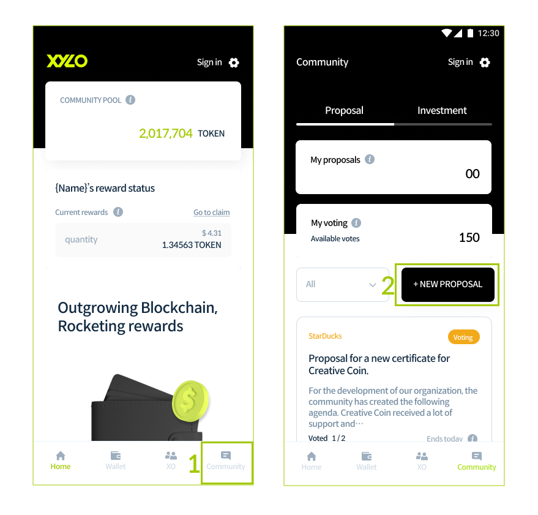

# XYLO ALL IN ONE GUIDE

## XYLO&#x20;

The XYLO wallet address will automatically be generated after downloading the app and once membership registration is complete.The XYLO Wallet can be used for TOKEN deposits, community pool transfers, reward withdrawals as well as bridge service wallet linkage, etc.&#x20;


XYLO APP uses the Groundchain network, so please convert the network of TOKEN by using the bridge when sending TOKEN of Ethereum network. Due to the nature of digital assets, recovery is not possible in case of incorrect deposit. <mark style="color:red;background-color:red;">If you make a mistake, you can’t find TOKEN, so it is recommended to test conversion with a small amount of TOKEN first.</mark> <mark style="background-color:red;"></mark> Also, even if the wallet address format of TOKEN and Ethereum is the same, they do not use the same blockchain network, so please check the network type.


### Download XYLO app

1. Tap the download link for your operating system. Your device’s app store will open. (XYLO for Android)
2. Install the XYLO app on your phone.

### Sign Up

1. On the XYLO app, tap the Sign In button at the top. On the Sign In page, tap the Sign Up button to go to the membership page.&#x20;


To SEND TO COMMUNITY, you need XYLO Wallet. To create Wallet, please Sign Up first.&#x20;


<figure><figcaption></figcaption></figure>

2\. Enter your ID and Name.

3\. After entering the Password, please enter it again for security measures.

4\. Enter your Email and tap the Activate button.&#x20;


The email entered will be used for verification purposes so please be sure to enter a valid email address.


<figure><figcaption></figcaption></figure>

5\. Open your verification email and copy the verification code.

6\. Enter verification code in the app and tap the Confirm button.

7\. Agree to Terms of use and Privacy policy.

8\. Tap the CREATE ACCOUNT button.

<figure><figcaption></figcaption></figure>

### Complete registration and Sign In

1. Welcome! Registration is complete. You can now tap the Sign In button.
2. Enter your ID and Password. (Automatic login: optional) If you’ve lost your Password, you can reset it through the Forgot Password function.
3. Tap the Sign In button to go to the main page after signing in.

<figure><figcaption></figcaption></figure>

### Confirm Wallet Address

1. Go to the Wallet menu at the bottom of the app.
2. Check the wallet address created with the subscription and relevant assets.

<figure><figcaption></figcaption></figure>

### Receive tokens from Exchange

1. Buy tokens from exchanges that support TOKEN.
2. Send tokens to the Metamask wallet address.
3. Change TOKEN's network using the Bridge. Please refer to Use Bridge for more information on how to use it.

## BRIDGE&#x20;

### Add TOKEN token to Metamask

1. Check the network (Ethereum Mainnet).
2. Click Import tokens.
3. Select the Custom Token tab.
4. Enter the Token Contract Address.&#x20;

```
0x9b9647431632af44be02ddd22477ed94d14aacaa
```

5\. Click the Add Custom Token button.&#x20;


When you enter the Token Contract Address, the Token Symbol and Token Decimal are automatically entered


6\. Click the Import Tokens button.

7\. Added TOKEN token. If you make an incorrect deposit, you can’t find TOKEN, so it is recommended to test conversion with a small amount of TOKEN first.


If you make an incorrect deposit, you can’t find TOKEN, so it is recommended to test conversion with a small amount of TOKEN first.


### Ethereum -> Ground chain conversion

#### Step 01

1. Click the Asset select box.
2. If the Select coin window pops up, select TOKEN and click the Select button.

#### Step 02

1. Click the From select box and select Ethereum.
2. Select Metamask and click the OK button.&#x20;


Network Error message pops up when your Metamask network isn't on the Ethereum mainnet.


3\. Click the To select box and select XYLO Ground Chain.

4\. Select the XYLO Wallet and click the OK button.

5\. Enter the ID and password created when signing up for the XYLO app.&#x20;


If you don't have an account, you need to sign up. Please refer to the Get Started for more information on signing up.


6\. Destination for the To chain is automatically entered.

#### Step 03

1. Enter the amount of TOKEN to convert. Enter the amount excluding the fee.&#x20;


The minimum conversion amount is 100TOKEN. In case of converting amount less than minimum amount, Error message pops up.


2\. Click the Convert button.

3\. On the Check the coin to convert pop-up, check the contents entered, fees, and precautions, and click the OK button. &#x20;


In case of conversion from Ethereum to Groundchain, a tax and 20 TOKEN bridge fees are charged.



Clicking OK button, you need to set the desktop notification for the first time. If the notification settings window appears, please accept it.


#### Step 04

1. Proceed with the confirmation process on Metamask connected to the From chain. A small amount of Ethereum gas cost occurs.
2. Check the gas fee on the Metamask connected to From Chain. A small amount of Ethereum gas cost occurs.
3. When the From chain approval process is completed, a transaction is created. When you click on the transaction hash, you can go to Explorer for more transaction information.
4. On the Bridge page, click the Confirm button which is separately created To chain.
5. Click the Approve button to proceed approval action of To Chain.
6. After approval of To chain, you can check the transaction. Conversion is completed.&#x20;


You can check converted TOKEN on the Wallet page of XYLO APP.


### **Checking History**

1. You an check transaction state by going to the History menu.&#x20;

#### History state



Conversion is successfully completed.



Transaction authorization is required from the wallet connected to the To chain. Click Confirm to proceed with the approval process.



The transaction is currently in progress. Wait for the transition to be changed to a complete state.



Timeout or fail to convert in the wallet connected to the To chain. Click the Refund button to proceed with the refund.



### In case of conversion failure&#x20;

#### Conversion failed when using the Bridge&#x20;

In case of conversion failure or unexpected error when using the Bridge, you can check all your TOKEN conversion history in the History menu.&#x20;

You can proceed confirmation by clicking Confirm button in the History. In addition, you can get a refund 48 hours after Confirm button appears.


## DELEGATE&#x20;

#### Community Pool investment

1. After signing in XYLO app, go to Wallet menu.
2. Tap the SEND TO COMMUNITY POOL button.&#x20;


To invest in Community Pool, TOKEN is needed.&#x20;

Sign up and send TOKEN to your wallet through Bridge.


<figure><figcaption></figcaption></figure>

3\. Agree with the precautions, And enter the amount of TOKEN you want to remit.

4\. Tap the NEXT button.&#x20;


Enter amount considering fees. Minimum amount is 10 TOKEN.


<figure><figcaption></figcaption></figure>

5\. Check the amount of TOKEN, And tap the SEND button.

6\. Enter your password in pop up page.

7\. Tap the OK button.&#x20;

<figure><figcaption></figcaption></figure>

8-1. Transaction proceeds.&#x20;

8-2. Check the success message.

9\. Tap the OK button.

10\. You can go to the Wallet menu to view XOP and transactions.

<figure><figcaption></figcaption></figure>

### XOP delegation

1. Go to the XO menu at the bottom.
2. Tap the DELEGATE button.


2-1. You can see detailed information of resoective XO by clicking XO name in the XO list.

2-2. You can DELEGATE in XO detail page.


<figure><figcaption></figcaption></figure>

3\. Select the XO.

4\. Enter the XOP you want to delegate.

5\. Tap the NEXT button.

<figure><figcaption></figcaption></figure>

6\. Check the XO and XOP and tap the SEND button.

7\. Enter your password.

8\. Tap the OK button.&#x20;

<figure><figcaption></figcaption></figure>

9-1. Transaction proceeds.&#x20;

9-2. Check the success message.

10\. Tap the OK button.

<figure><figcaption></figcaption></figure>

11\. You can check the status and rewards of delegation on the detailed page of the delegated XO.

12\. You can see XOP transaction in detail page.&#x20;


Depending on network condition, XOP amount may be reflected after a little while.


<figure><figcaption></figcaption></figure>

### Reward claim

1. After signing in XYLO App, go to XO menu.
2. Go to the details page of the delegated XO.
3. After checking the reward, tap the CLAIM button.

<figure><figcaption></figcaption></figure>

4\. Check the TOKEN amount and tap the CONFIRM button.

5\. Enter your password.

6\. Tap the OK button.

<figure><figcaption></figcaption></figure>

7\. Transaction proceeds.

8\. Check the success message.

9\. Tap the OK button.

10\. You can check the transection the details page of the delegated XO.

11\. Go to the Wallet menu and check the TOKEN and transactions. Download XYLO app.

<figure><figcaption></figcaption></figure>

## Community&#x20;

### Posting a Proposal

1. Go to the Community menu.
2. Click the 'NEW PROPOSAL' button.

<figure><figcaption></figcaption></figure>

3\. Type your title.

4\. Write your content.

5\. (Optional) Enter your URL of the topic you want for investment pre-screening in the XYLO forum.

6\. Agree to the proposal policy.

7\. Click on the next button.

<figure><figcaption></figcaption></figure>

8\. When you click Available on the Send deposit page, a deposit of 10,000 TOKEN will be automatically entered. Transaction fees for transmitting deposits are separate.

9\. After entering the deposit, click on the next button.

10\. Click the PROPOSE button.

<figure><figcaption></figcaption></figure>

11\. Enter your password in the "Enter your password" pop-up.

12\. Click on the OK button.

<figure><figcaption></figcaption></figure>

13\. When the success message is displayed, click the OK button to finish posting the voting proposal and you will be redirected to the main page.

<figure><figcaption></figcaption></figure>

### Checking Proposals by Voting Status&#x20;


You can check the voting status of proposals at the top right of each card. By clicking the number in My Votes, you can filter and view proposals that are eligible for you to vote.


1. Go to the Community menu.
2. Click ALL at the left of NEW PROPOSAL button.
3. Voting status is displayed in four categories: ALL, Voting, Passed and Rejected. Click the status you want to check.

<figure><figcaption></figcaption></figure>

### Participating in Voting.

1. Click on the proposal you want to vote for and it will send you to the detail page.
2.  Click the VOTE button on the selected proposal.&#x20;

    2-1. You can check the voting status at the bottom of this page.&#x20;


By the end of the voting period, the XO can submit a final opinion only if the XOM voting participation rate is at least 20% based on the voting power. When a participation rate of 20% or more is reached, the XO who can submit final opinions is displayed through separate color processing in the voting status section.


<figure><figcaption></figcaption></figure>

3\. If you do not have the right to vote, this page appears. If you have XOP in your wallet, you can delegate them by proceeding by clicking the DELEGATE button, and you can receive XOP through investing community pool to delegate.

<figure><figcaption></figcaption></figure>

4\. If you have voting rights, you can check the XO's list of XOM voting power where you have delegated over 100 XOP and you can choose YES or NO for the selected proposal. Once submitted, your decision cannot be changed.

5\. Click the VOTE button to complete the voting according to your opinion.

<figure><figcaption></figcaption></figure>

6\. If you have multiple votes for more than one XO, you can select your opinion and vote for each SO to which your voting tickets are issued.&#x20;

&#x20;  6-1. If you click on the VOTE button, the voting completion message will be displayed, and the name of the XO group that you voted for will also be shown.&#x20;

&#x20;  6-2. In addition, the voting results reflected in the voting status will be displayed.&#x20;

&#x20;  6-3. Votes that have already been completed cannot be edited, and votes that have not been processed can be voted on.

<figure><figcaption></figcaption></figure>

<figure><figcaption></figcaption></figure>

7\. If you have multiple voting rights, you can vote with different choices for each voting power.&#x20;

7-1. If multiple voting rights are used, a voting completion message is displayed and the names of each XO group that you completed will be shown.&#x20;

7-2. If multiple voting rights are used, the voting results reflected in Voting status are exposed as much as you used.

<figure><figcaption></figcaption></figure>


### Checking Voting Result&#x20;


When the voting ends, the voting results for each XO are automatically counted. In the final vote for each XO, the final opinion according to the voting results of the XOM members and the voting power of the XO are submitted. The XO that can submit a final vote must have a quorum of 40% or more and a vote in favor of 50% or more. Only when these conditions are met the proposal will be passed. Please refer to the XYLO VC process for a detailed explanation of the voting results.&#x20;


**If a proposal failed to pass voting.**

1. If a proposal is thrown out, the voting status will be marked as Rejected.
2. Click the MY VOTES button to check your voting results on the detail page of a proposal that has closed voting.&#x20;

2-1. You can check the voting results on the My Voting page.

3\. You can check the voting results reflecting XO's voting power in the Vote Overview section.

4.You can check the XO's quorum in the Turnout section.

5.You can check each voting result(XOM voting result) for XO group in the XO group result section.

<figure><figcaption></figcaption></figure>

**If a proposal passed voting.**

1. If a proposal is approved, the voting status will be marked as Passed.
2. Click the MY VOTES button to check your voting results on the detail page of a proposal that has closed voting.&#x20;

2-1. You can check the voting results on the My Voting page.

3\. You can check the voting results reflecting XO's voting power in the Vote Overview section.

4\. You can check the XO's quorum in the Turnout section.

5\. You can check each voting result(XOM voting result) for XO group in the XO group result section.

<figure><figcaption></figcaption></figure>

## XYLO Explorer

### Checking Block

### Checking Transaction

### Checking Account&#x20;
