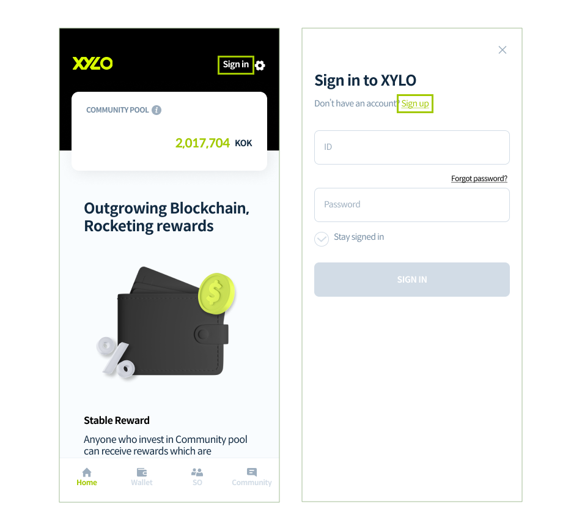
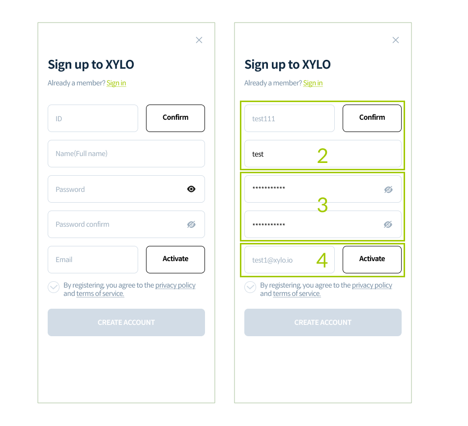
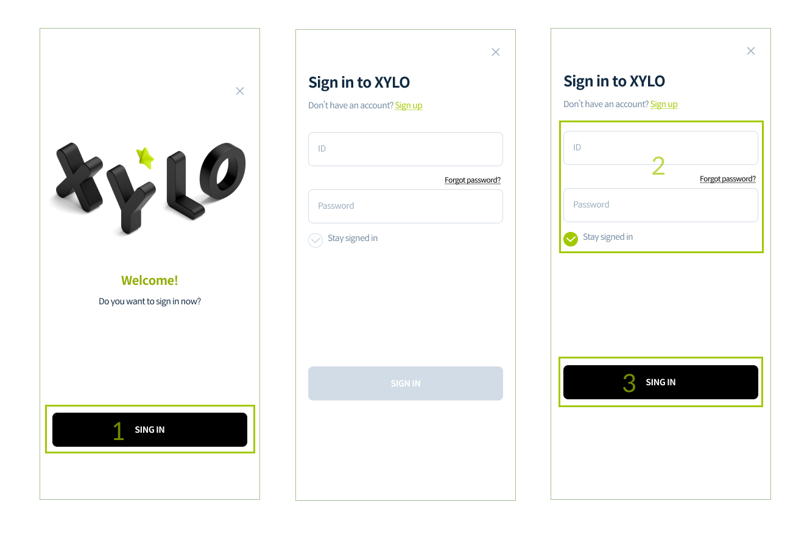
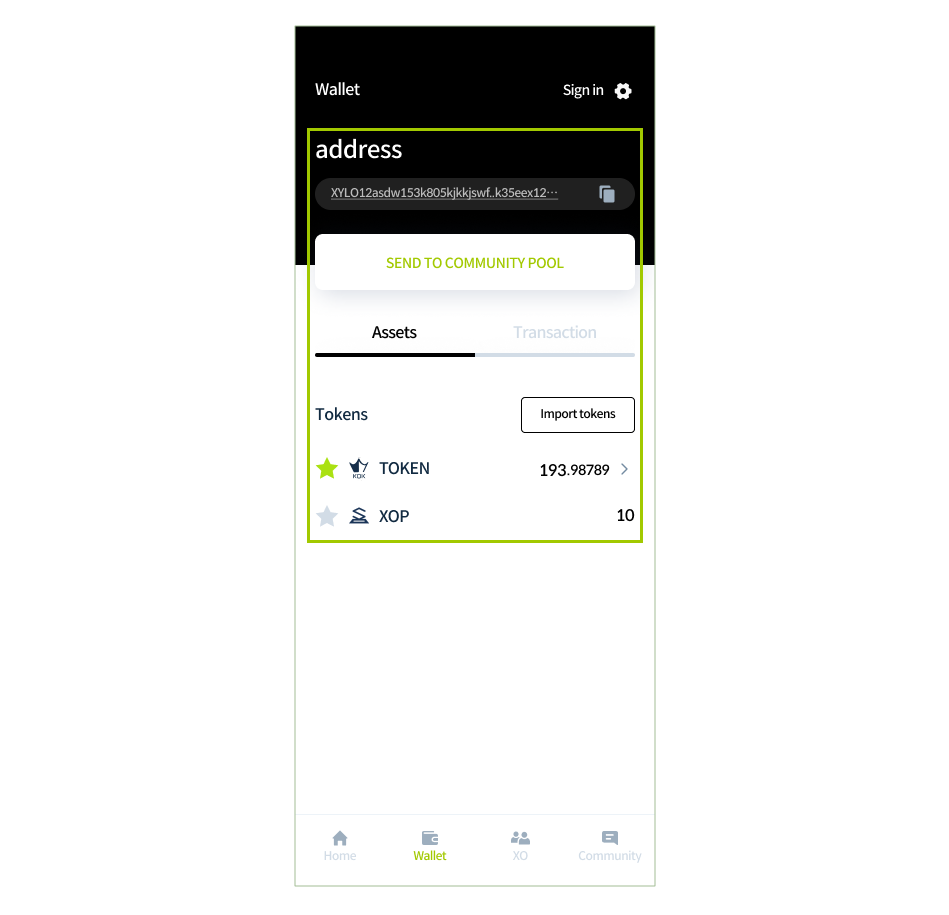

# Get Starded

The XYLO wallet address will automatically be generated after downloading the app and once membership registration is complete.The XYLO Wallet can be used for TOKEN deposits, community pool transfers, reward withdrawals as well as bridge service wallet linkage, etc.&#x20;


XYLO APP uses the Groundchain network, so please convert the network of TOKEN by using the when sending TOKEN of Ethereum network. Due to the nature of digital assets, recovery is not possible in case of incorrect deposit. <mark style="color:red;background-color:red;">If you make a mistake, you can’t find TOKEN, so it is recommended to test conversion with a small amount of TOKEN first.</mark> Also, even if the wallet address format of TOKEN and Ethereum is the same, they do not use the same blockchain network, so please check the network type.


## Download XYLO app

1. Tap the download link for your operating system.(XYLO for Android , iOS )
2. Install the XYLO app on your phone.

## **Sign Up**

1. On the XYLO app, tap the Sign In button at the top. On the Sign In page, tap the Sign Up button to go to the membership page.&#x20;


To SEND TO COMMUNITY, you need XYLO Wallet. To create Wallet, please Sign Up first.


<figure><figcaption></figcaption></figure>

2\. Enter your ID and Name.

3\. After entering the Password, please enter it again for security measures.

4\. Enter your Email and tap the Activate button.&#x20;


The email entered will be used for verification purposes so please be sure to enter a valid email address.


<figure><figcaption></figcaption></figure>

5\. Open your verification email and copy the verification code.

6\. Enter verification code in the app and tap the Confirm button.

7\. Agree to Terms of use and Privacy policy.

8\. Tap the CREATE ACCOUNT button.

<figure><figcaption></figcaption></figure>

## Complete registration and Sign In

1. Welcome! Registration is complete. You can now tap the Sign In button.
2. Enter your ID and Password. (Automatic login: optional)&#x20;


If you’ve lost your Password, you can reset it through the Forgot Password function.


3\. Tap the Sign In button to go to the main page after signing in.

<figure><figcaption></figcaption></figure>

## Confirm Wallet Address

1. Go to the Wallet menu at the bottom of the app.
2. Check the wallet address created with the subscription and relevant assets.

<figure><figcaption></figcaption></figure>

## Receive tokens from Exchange

1. Buy tokens from exchanges that support TOKEN.
2. Send tokens to the Metamask wallet address.
3. Change TOKEN's network using the Bridge. Please refer to Use Bridge for more information on how to use it.
