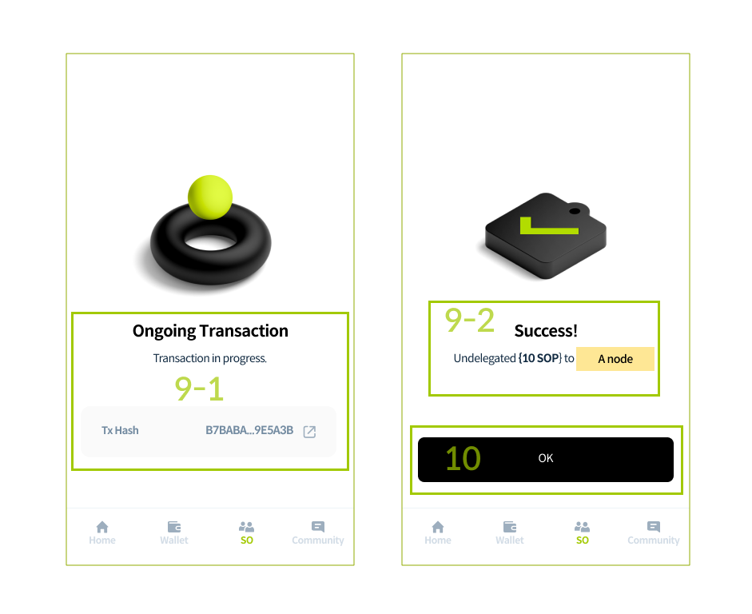
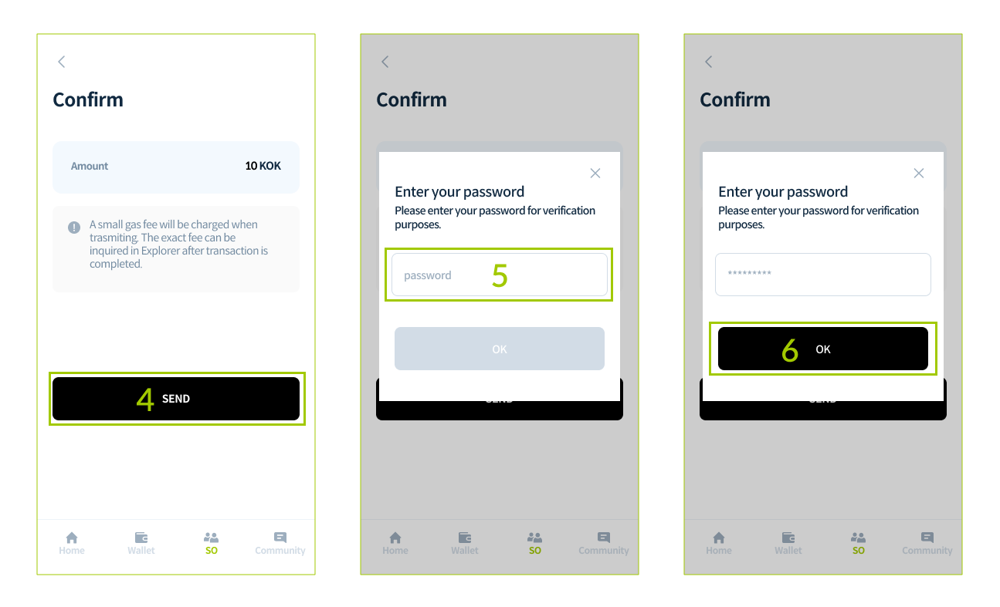
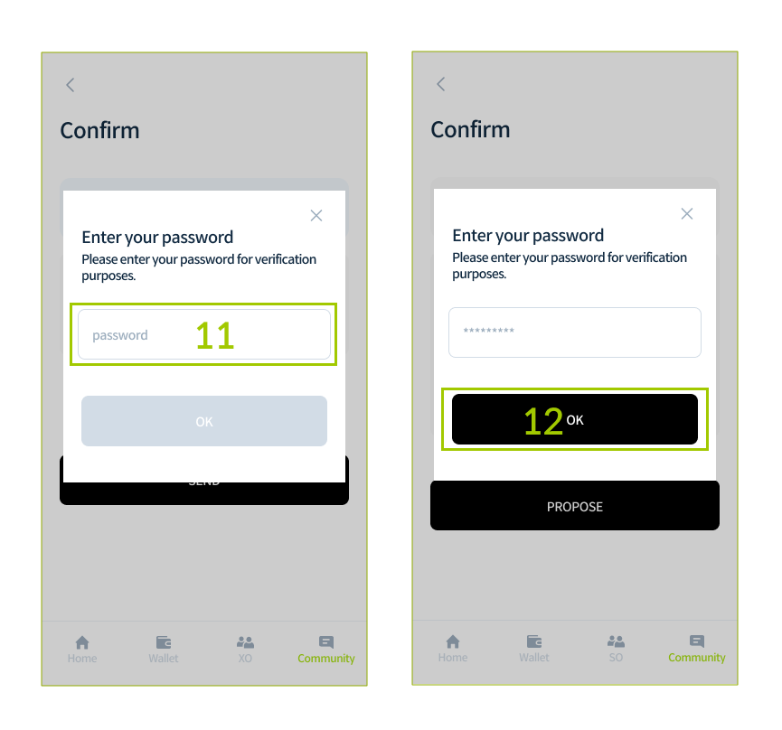
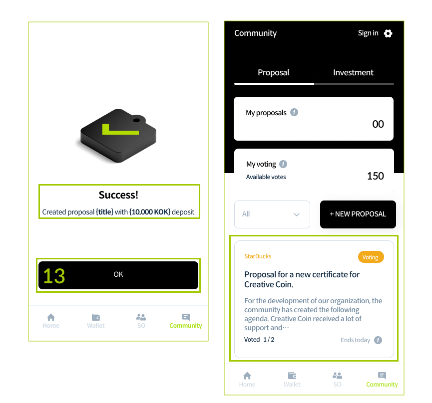
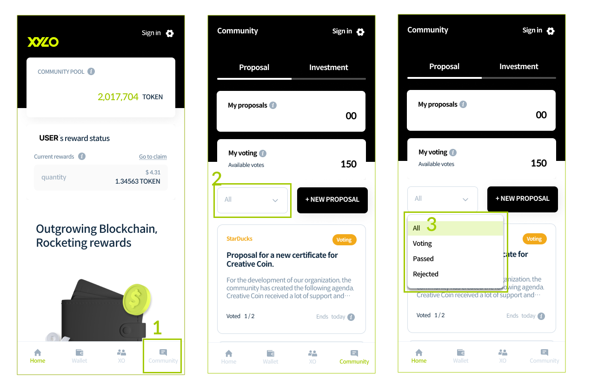
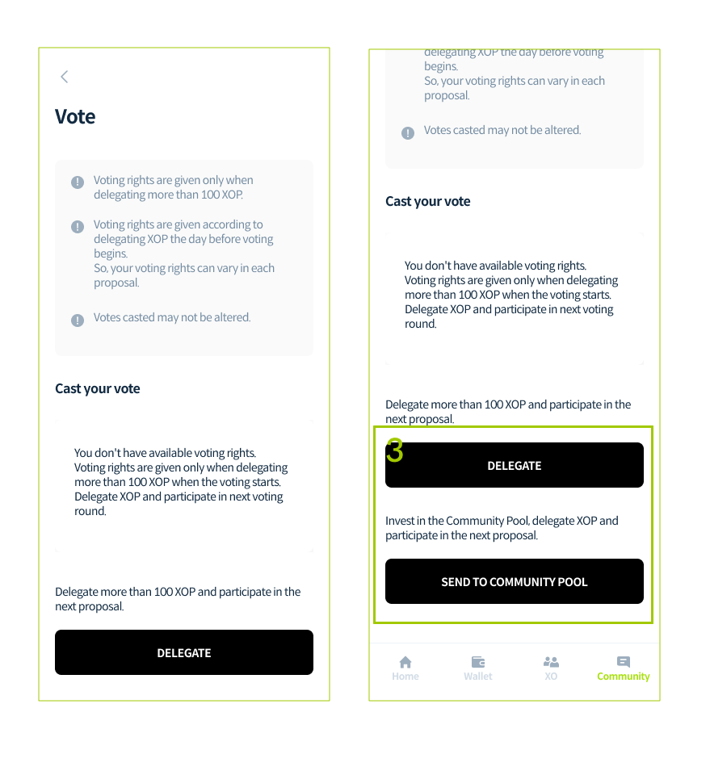
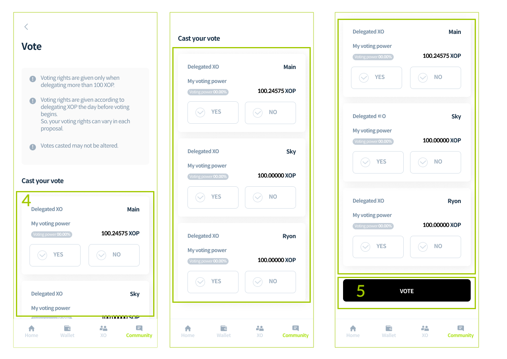
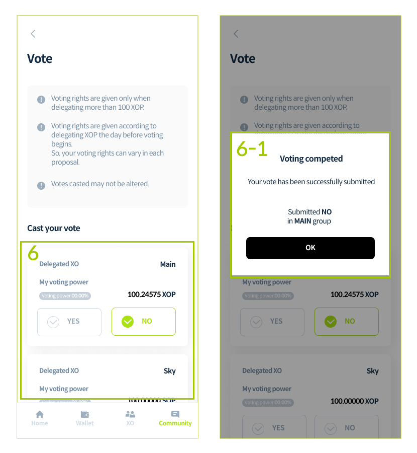
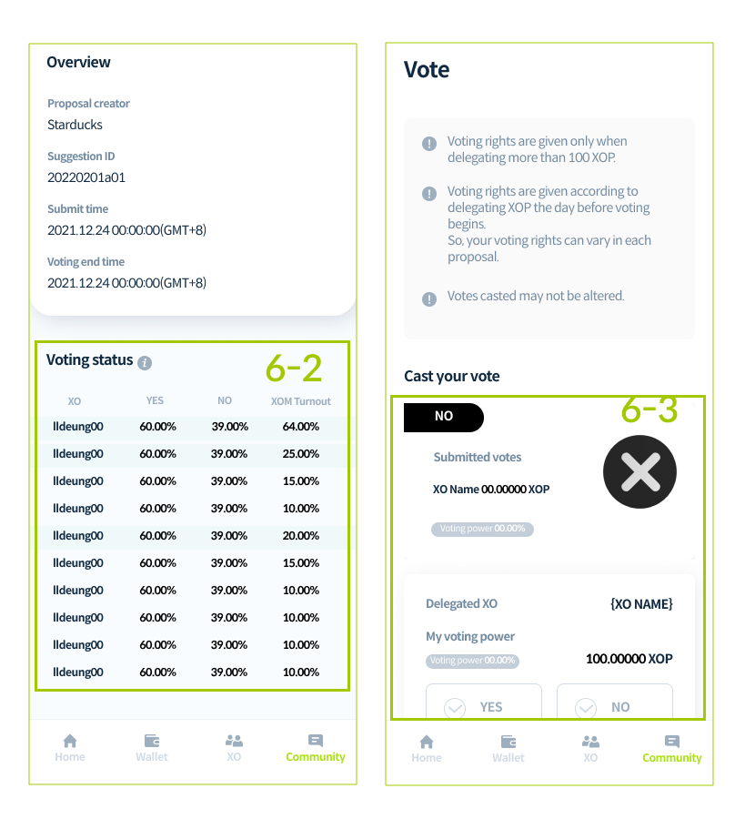
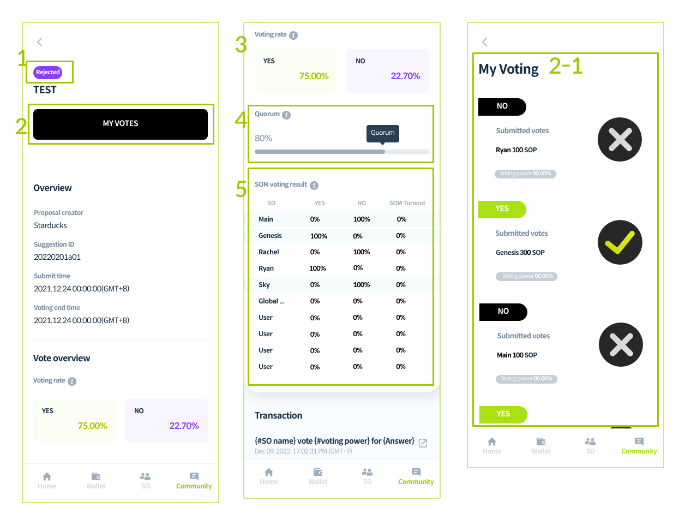

# Use XYLO

## Delegate 

### Community Pool investment

1. After signing in XYLO app, go to Wallet menu.
2. Tap the SEND TO COMMUNITY POOL button. 


To invest in Community Pool, TOKEN is needed. ​ sign up and send TOKEN to your wallet through Bridge.


<figure><figcaption></figcaption></figure>

3\. Agree with the precautions, And enter the amount of TOKEN you want to remit.

4\. Tap the NEXT button.&#x20;


Enter amount considering fees. Minimum amount is 10 TOKEN.


<figure><figcaption></figcaption></figure>

5\. Check the amount of TOKEN, And tap the SEND button.

6\. Enter your password in pop up page.

7\. Tap the OK button.&#x20;

<figure><figcaption></figcaption></figure>

8-1. Transaction proceeds.&#x20;

8-2. Check the success message.

9\. Tap the OK button.

10\. You can go to the Wallet menu to view XOP and transactions.

<figure><figcaption></figcaption></figure>

### XOP delegation

1. Go to the XO menu at the bottom.

2\. Tap the DELEGATE button.&#x20;


2-1. You can see detailed information of resoective SO by clicking XO name in the XO list.&#x20;

2-2. You can DELEGATE in XO detail page.


<figure><figcaption></figcaption></figure>

3\. Select the XO.

4\. Enter the XOP you want to delegate.

5\. Tap the NEXT button.

<figure><figcaption></figcaption></figure>

6\. Check the XO and XOP and tap the SEND button.

7\. Enter your password in pop up page.

8\. Tap the OK button.&#x20;

<figure><figcaption></figcaption></figure>

9-1. Tansaction proceeds.&#x20;

9-2. Check the success message.

10\. Tap the OK button.

<figure><figcaption></figcaption></figure>

11\. You can check the status and rewards of delegation on the detailed page of the delegated XO.

12\. You can see SOP transaction in detail page.


&#x20;Depending on network condition, XOP amount may be reflected after a little while.


<figure><figcaption></figcaption></figure>

### Reward claim

1. After signing in XYLO App, go to XO menu.
2. Go to the details page of the delegated XO.
3. After checking the reward, tap the CLAIM button.

<figure><figcaption></figcaption></figure>

4\. Check the TOKEN amount and tap the CONFIRM button.

5\. Enter your password.

6\. Tap the OK button.

<figure><figcaption></figcaption></figure>

7\. Transaction proceeds.

8\. Check the success message.

9\. Tap the OK button.

<figure><figcaption></figcaption></figure>

10\. You can check the transection the details page of the delegated XO.

11\.  Go to the Wallet menu and check the TOKEN and transactions.Download XYLO app.

<figure><figcaption></figcaption></figure>

## Community&#x20;

### aPosting a Proposal

1. Go to the Community menu.
2. Click the 'NEW PROPOSAL' button

<figure><figcaption></figcaption></figure>

3\. Type your title.

4\. Write your content.

5\. (Optional) Enter your URL of the topic you want for investment pre-screening in the XYLO forum.

6\. Agree to the proposal policy.

7\. Click on the next button.

<figure><figcaption></figcaption></figure>

8\. When you click Available on the Send deposit page, a deposit of 10,000 TOKEN will be automatically entered. Transaction fees for transmitting deposits are separate.

9\. After entering the deposit, click on the next button.

10\. Click the PROPOSE button.

<figure><figcaption></figcaption></figure>

11\. Enter your password in the "Enter your password" pop-up.

12\. Click on the OK button.

<figure><figcaption></figcaption></figure>

13\. When the success message is displayed, click the OK button to finish posting the voting proposal and you will be redirected to the main page.

<figure><figcaption></figcaption></figure>

### Checking Proposals by Voting Status&#x20;


You can check the voting status of proposals at the top right of each card. By clicking the number in My Votes, you can filter and view proposals that are eligible for you to vote.


1. Go to the Community menu.
2. Click ALL at the left of NEW PROPOSAL button.
3. Voting status is displayed in four categories: ALL, Voting, Passed and Rejected. Click the status you want to check.

<figure><figcaption></figcaption></figure>

### Participating in Voting.

1. Click on the proposal you want to vote for and it will send you to the detail page.
2. Click the VOTE button on the selected proposal. \
   2-1. You can check the voting status at the bottom of this page.


By the end of the voting period, the XO can submit a final opinion only if the XOM voting participation rate is at least 20% based on the voting power. When a participation rate of 20% or more is reached, the XO who can submit final opinions is displayed through separate color processing in the voting status section.


<figure><figcaption></figcaption></figure>

3\. If you do not have the right to vote, this page appears. If you have XOP in your wallet, you can delegate them by proceeding by clicking the DELEGATE button, and you can receive XOP through investing community pool to delegate.

<figure><figcaption></figcaption></figure>

4\. If you have voting rights, you can check the XO's list of XOM voting power where you have delegated over 100 XOP and you can choose YES or NO for the selected proposal. Once submitted, your decision cannot be changed.

5\. Click the VOTE button to complete the voting according to your opinion.

<figure><figcaption></figcaption></figure>

6\. If you have multiple votes for more than one XO, you can select your opinion and vote for each XO to which your voting tickets are issued. \
&#x20; 6-1. If you click on the VOTE button, the voting completion message will be displayed, and the name of the XO group that you voted for will also be shown. \
&#x20; 6-2. In addition, the voting results reflected in the voting status will be displayed. \
&#x20; 6-3. Votes that have already been completed cannot be edited, and votes that have not been processed can be voted on.

<figure><figcaption></figcaption></figure>

<figure><figcaption></figcaption></figure>

7\. If you have multiple voting rights, you can vote with different choices for each voting power.&#x20;

7-1. If multiple voting rights are used, a voting completion message is displayed and the names of each XO group that you completed will be shown.&#x20;

7-2. If multiple voting rights are used, the voting results reflected in Voting status are exposed as much as you used.

<figure><figcaption></figcaption></figure>

### Checking Voting Result&#x20;


When the voting ends, the voting results for each XO are automatically counted. In the final vote for each XO, the final opinion according to the voting results of the XOM members and the voting power of the XO are submitted. The XO that can submit a final vote must have a quorum of 40% or more and a vote in favor of 50% or more. Only when these conditions are met the proposal will be passed. Please refer to the XYLO VC process for a detailed explanation of the voting results.


**If a proposal failed to pass voting.**

1. If a proposal is thrown out, the voting status will be marked as Rejected.
2. Click the MY VOTES button to check your voting results on the detail page of a proposal that has closed voting.

2-1. You can check the voting results on the My Voting page.

3\. You can check the voting results reflecting XO's voting power in the Vote Overview section.

4\. You can check the XO's quorum in the Turnout section.

5\. You can check each voting result(XOM voting result) for XO group in the XO group result section.

<figure><figcaption></figcaption></figure>

**If a proposal passed voting.**

1. If a proposal is approved, the voting status will be marked as Passed.
2. Click the MY VOTES button to check your voting results on the detail page of a proposal that has closed voting.&#x20;

2-1. You can check the voting results on the My Voting page.

3\. You can check the voting results reflecting XO's voting power in the Vote Overview section.

4\. You can check the XO's quorum in the Turnout section.

5\. You can check each voting result(XOM voting result) for XO group in the XO group result section

<figure><figcaption></figcaption></figure>
